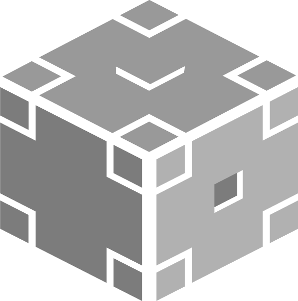

# generator-lego
This is a concept to build web applications based on the idea that build applications should be like building Lego houses: putting blocks ending with a complete application.

### Advantage
  - Keep sort code
  - Build applications like a human not like machines we are not asyncronus  
  - Coding in ES6  
  - Magic

### Installation

```sh
$ npm i -g yo
$ npm i -g nodemon
$ npm i generator-stack-lego
```
### Start project 

```sh
$ mkdir myProject && cd myProject && yo stack-lego 
```

this will prepare the environment of development with this files:


### Blocks 
This are pieces that fulfill a specific function eg in a web form system is required to handle routing, access token, cookies etc ...

In node js there are several modules to do that kind of thing the most popular is express js so the generator lego works split the each one of the functions of block that put one on other forming a stack.

In this version just are two block:
* express
* mongodb

### Express block


For start follow next command:
```sh
$ yo stack-lego:block express 
```
then that was install all basic middlewares that express need :

### [Cors](https://www.npmjs.com/package/cors) 

For handler permissions and communications between servers.

### [Multer](https://www.npmjs.com/package/multer) 
For handler some http verbs and multipart data. 

### [Method Override](https://www.npmjs.com/package/method-override) 
For handler some http verbs.

Please follow the guide to use this awesome block in this link [ stack-lego block express ](./blocks/express/guide.md)

### Mongodb block 


For start follow next command:
```sh
$ yo stack-lego:block mongodb
```
then the generator will install one driver of mongodb called [mongoose](http://mongoosejs.com/) 
Please follow the guide to use this awesome block in this link [ stack-lego block mongodb ](./blocks/mongodb/guide.md)


License
----

GNU

