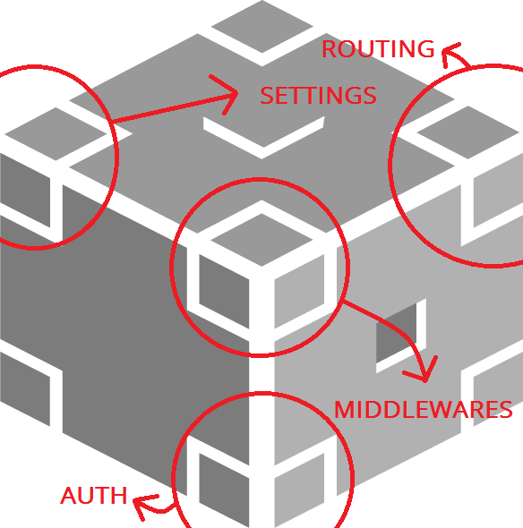
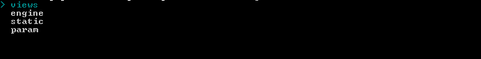
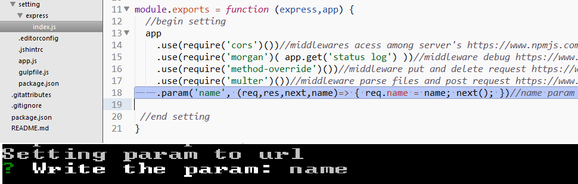
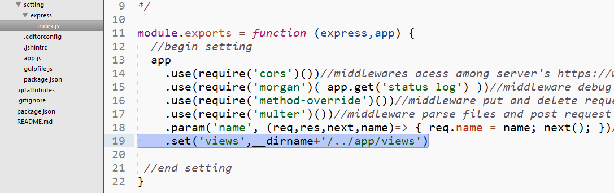
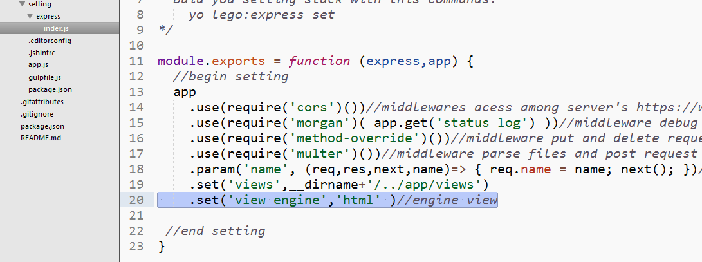
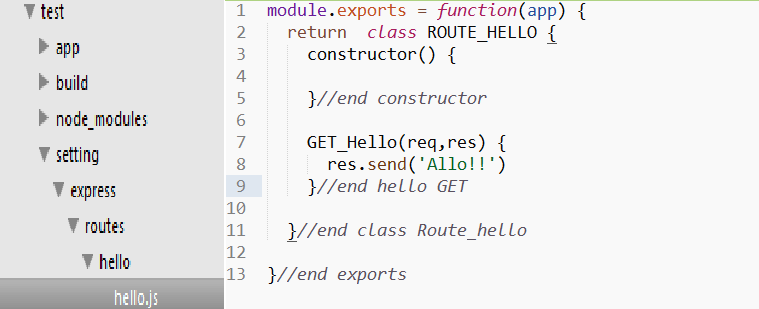
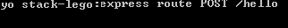
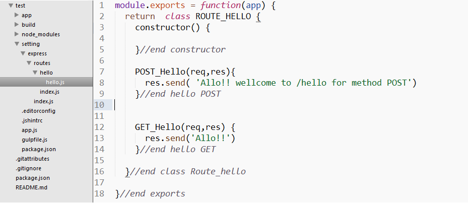

# Guide express block
Once plugged the block on the base generated with:
```sh
	yo stack-lego:block express
```


Then start, express have much functions to do routing, authorization, statics files etc.. this block split all this functions with a command for each one:

### Setting
This way display all set command that this block have 

```sh
	yo stack-lego:express set
```



### Setting url param
Add param method with the name provide for the user in setting folder or the file app.js .

```sh
	yo stack-lego:express set param
```



### Setting views
Set one attribute called views in the app object to be used after.

```sh
	yo stack-lego:express set views
```



### Setting engine
Set one attribute called engine render in the app object to be used after.

```sh
	yo stack-lego:express set engine
```




### Setting statics files
Set the folder where is you statics file according the path provider for the user relative to the setting folder or the main file app.js

```sh
	yo stack-lego:express set static
```


### Routes 
Generate one route with the method and path providers for the user and one file with the name of the path that contain the class to handler all this thing that route need,in case of user choice not get the setting > route then this will generate in the main file app.js   

```sh
	yo stack-lego:express route <method in uppercase> <path>
```



Too can be used on existing routes, with diferent method

 <br/>



