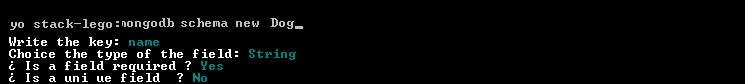
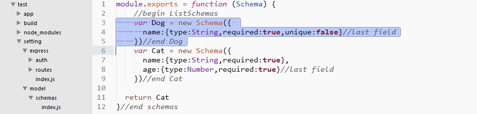
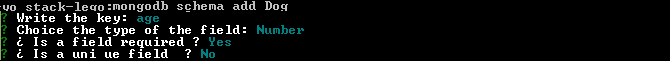
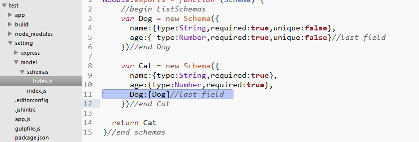
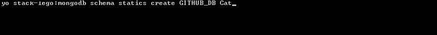

# Mongodb block guide 
Once plugged the block on the base generated with:
```sh
	yo stack-lego:block mongodb
```


### Warning 
 Please don't remove the comments, this block exits two streams for build one app

### 1- All on the main files 
 
Just when the generator asking for something like if you wanna create one folder for something answer no allway, this way mean everything will be generated on the app.js file, this is only recommended if you do not know the driver


### 2- Divide and conquer
Just when the generator asking for something like if you wanna create one folder for something answer yes allway , this way the generator got to split the app in separate folders while generate all.

 
First this know the [uri](http://mongoosejs.com/docs/connections.html) to connect with the next questions, mongodb provide drivers for different platform this block work with [mongoose](http://mongoosejs.com/) one of most popular 


Then generate this file with the data provided 


For default this generate a schema for test called cat this block is specialized for play with the schemas with the next command: 

### Create schema

```sh 
   yo stack-lego:mongodb schema new <someName>
```


This generate a new schema into the schemas file with the data provided for create the filed of the schema 

### Add field to one exist schema

```sh 
  yo stack-lego:mongodb schema add <existing schema>
```


This generate a new field into the existing schema with the data provided


### Extends schemas

```sh 
  yo stack-lego:mongodb schema extend <schema to extend> <schema base>
```



This will extend one schema from other with the data provider 


### Schema  static method 

```sh 
      yo stack-lego:mongodb schema statics <name of static method> <existing model> <existing schema>
```




This generate the basic structure for create [statics methods](http://mongoosejs.com/docs/guide.html) of mongoose for simplify you code

### ¿How to run this? 
So easy 
```sh 
   gulp
```